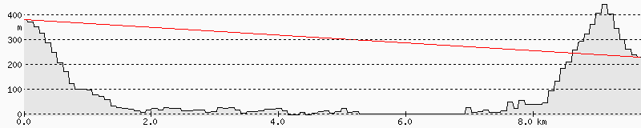
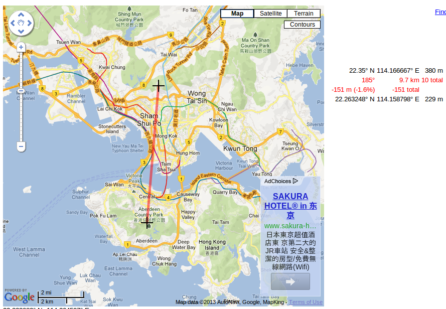

Preliminary results of outdoor testing on 5 GHz in HK

Date: 2012-02-04

Equipment: 2 Ubiquiti Airgrid M5, 27" grid antennas

Locations: 

1) Beacon Hill, Kowloon Tong

2) The Peak

Path Profile and Map:

Created using http://www.heywhatsthat.com/profiler.html
